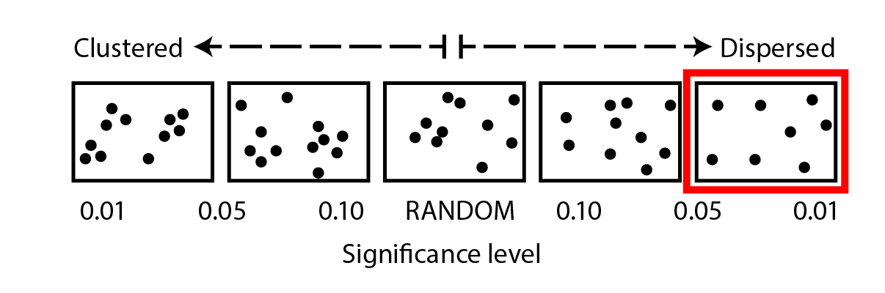

# Results {#result}

## Mapping 
The Geographical coordinate points of ten fish landing sites located in south of Bagamoyo and Kinondoni Districts are summarized in table \@ref(tab:tab41). These points were used to map the location of fish landing sites in GIS environment. Together with other fisheries attributes, these points enabled making of thematic maps for artisanal fisheries sector in the studied area. 

```{r package-result, warning=FALSE, message=FALSE, comment="", echo=FALSE}
require(tidyverse)
require(kableExtra)
require(leaflet)
require(ggsci)

```


```{r tab41, warning=FALSE, message=FALSE, comment="", echo=FALSE}

kinondoni = data.frame(site = c("Msasani","Kunduchi", "Ununio", "Mbweni"),
          lon = c(39.269,39.219, 39.178, 39.136),
          lat = c(-6.760, -6.668, -6.627, -6.576)) %>%
  mutate(district = "Kinondoni")

bagamoyo = data.frame(site = c("Changwahela", "Mlingotini", "Mbegani", "Kaole", "Custom", "Nchipana"),
           lon = c(39.087,39.0,38.970,38.941,38.910,38.907 ),
           lat = c(-6.523,-6.479,-6.472,-6.459,-6.440, -6.436)) %>%
  mutate(district = "Bagamoyo")

site = kinondoni %>% bind_rows(bagamoyo)

site %>%
  select(district, site, lon, lat) %>%
  kable("html", caption = "Geographical positions of selected fish landing sites", col.names = c("District", "Landing site", "Longitude","Latitude")) %>%
  column_spec(column = 1:4, width = "3cm") %>%
  add_header_above(c("", "", "Geographical Positions" = 2))
```


## Length of the coastline
The fish landing sites within the Kinondoni and Bagamoyo district lay within a coastline of about 67.62 km long, with Changwahela having the longest coastline followed by Msasani, Kunduchi Mbweni and, Ununio, whereas Nchipana and Custom were observed to be close to each other and were the landing sites with the shortest length of coastline in the study area. In general, Bagamoyo sites (Figure \@ref(fig:fig42)) are closer to each other than those at Kinondoni District (Figure \@ref(fig:fig41)).
 

```{r fig41, fig.cap="Length of the coastline for fish landing sites at Kinondoni Districts", echo=FALSE}

leaflet(data = site %>% filter(district == "Kinondoni")) %>%
  addTiles() %>%
  addMarkers(lng = ~lon, lat = ~lat, popup = ~site)

```


```{r fig42, fig.cap="Length of the coastline for  fish landing sites at  Bagamoyo Districts", echo=FALSE}

leaflet(data = site %>% filter(district == "Bagamoyo") ) %>%
  addTiles() %>%
  addMarkers(lng = ~lon, lat = ~lat, popup = ~site)

```

##	Spatial distribution of fish landing sites
Although the landing sites in Bagamoyo District (Figure \@ref(fig:fig42)) were closer to each other than for Kindondoni district (Figure \@ref(fig:fig41)), the distance interval between sites were not clustered but rather spatially dispersed and significant The dispersion of landing sites was significant the result was significant ( *P* < 0.01, Figure \@ref(fig:fig43)). 

```{r fig43, fig.cap="Average Nearest Neighbor Tool showing the statistical results of distribution pattern of fish landing sites across the study area", echo=FALSE}

# 

cowplot::ggdraw() +
cowplot::draw_image("./_book/graphics/distribution_patten.png", scale = .75)

```

 
##	Spatial Pattern of fishing vessels
Fishing vessels were used as spatial attribute to determine the spatial characteristics of the fish landing sites.  Two approaches were deployed for the determination of distribution pattern of fishing vessel; the first approach was to determine if there is any kind of pattern of fishing vessels, the results obtained by running Spatial Autocorrection (Moran’s I) tool, showed concentration pattern of fishing (p<0.10, Figure \@ref(fig:fig44)).  As shown in the figure 5. Msasani, Kunduchi and Ununio had slightly higher abundance of fishing vessels comapared to other landing sites, and Mlingotini was found to have the lowest number of fishing vessels in the study area

```{r fig44, fig.cap="oran’s I Tool showing the statistical results of distribution pattern of fishing vessels across the study area", echo=FALSE}

# knitr::include_graphics("./graphics/morans_I.png")

cowplot::ggdraw() + 
  cowplot::draw_image("./_book/graphics/morans_I.png", scale = .75 )

```
 
Figure \@ref(fig:fig45) Shows concentration of fishing vessels at fish landing sites ranges from a small amount of fishing vessels (negative value) progressing toward landing sites with a lot of fishing vessels (positive values).

```{r fig45, fig.cap="concentration of fishing vessels at fish landing sites ranges from a small amount of fishing vessels (negative value) progressing toward landing sites with a lot of fishing vessels (positive values).", echo=FALSE}
zscore = site %>% 
  mutate(zscore = c(2.59, 1.97, 1.66, -1.64,-1.64, -5.23, -1.64,-1.64,-1.64,-1.64))

# zscore$zscore = as.factor(zscore$zscore)

# qpal <- colorQuantile("RdYlBu", zscore$zscore)
# 
# leaflet(data = zscore)%>%
#   addTiles() %>%    
#   addCircleMarkers(lng = ~lon,lat =  ~lat, color = ~qpal(zscore), group = "circles") %>%
#   addLegend("bottomright", pal = qpal, values = ~zscore,
#     title = "ZSCORE",
#     labFormat = labelFormat(prefix = "%"),
#     opacity = 1, labels = FALSE, include.lowest = TRUE )


pal <- colorNumeric("RdYlBu", zscore$zscore)

leaflet(data = zscore) %>%
  addTiles() %>%
  addCircleMarkers(~lon, ~lat, color = ~pal(zscore), group = "circles", radius = 20) %>%
  addLegend(pal = pal, values = ~zscore, group = "circles", position = "bottomleft", title = "Zscore", opacity = 1) %>%
  addLayersControl(overlayGroups = c("circles"))
```


##	Characteristics of fishing vessels

Surveying among landing site for each vessel category, sites of particularly high fishing vessel percentage composition were identified (Fig. 6). Much of the fishing vesels sugges that fishing landing sites wiwth more boats are those locate in the urban centers and with reliable fishing markets. Kunduchi and Custom landing sites contribute more than 80 of the boats in the study area (Figure \@ref(fig:fig46)a). The dugout canoe is used more in Kinondoni than Bagamoyo where the fishing landing sites of Kindondoni contributed more than  common  vessels for the fishing landing sites at Kinondoni district. All four landing sites from Kindondoni contributed more than 80% of the dugout canoe (Figure \@ref(fig:fig46)c). The outrigger canoe was widely distributed in all the landing sites except Mlingotini (Figure \@ref(fig:fig46)b). Under a different circumstance, Mlingotini landing sites contributed more than 50 perecnt of dhows alone (Figure \@ref(fig:fig46)d).


```{r echo=FALSE}

vessels = readxl::read_excel("./DATA  ENTRY SHEET.xls", sheet =1 )
vessels = vessels %>% slice(1:10) %>% select(-X, -Y)

vessels$Boat = as.integer(vessels$Boat)
vessels$`outrigger canoe` = as.integer(vessels$`outrigger canoe`)
vessels$dugoutcanoe = as.integer(vessels$dugoutcanoe)
vessels$dhow = as.integer(vessels$dhow)
vessels$mashua = as.integer(vessels$mashua)

vessel.p = vessels %>% transmute(boat = Boat/sum(Boat, na.rm = TRUE)*100,
                                 outrigger = `outrigger canoe`/sum(`outrigger canoe`, na.rm = TRUE)*100,
                                 dugout = dugoutcanoe /sum(dugoutcanoe, na.rm = TRUE)*100,
                                 dhow = dhow /sum(dhow, na.rm = TRUE)*100,
                                 mashua = mashua /sum(mashua, na.rm = TRUE)*100) %>%
  bind_cols(vessels %>% select(District = 1, site = 3)) %>%
  gather(key = "gear", value = "percentage", 1:5)
```


```{r fig46, fig.cap="Dominant vessels vary with fish landing site a) boats b) Outrigger canoe c) dugout Canoe and d) dhow", warning=FALSE, echo=FALSE}
boat = ggplot(data = vessel.p %>% filter(gear == "boat"), 
       aes(x = site, y = percentage, fill = District))+ geom_col()+
  scale_x_discrete(limit = c("Kunduchi", "Custom", "Msasani", "Mlingotini", "Kaole", "Mbegani", "Nchipanda","Mbweni", "Changwahela", "Ununio") %>% rev())+
  scale_y_continuous(position = "right", breaks = seq(5,60,10))+
  coord_flip()+
  theme_minimal()+
  theme(aspect.ratio = .75,
        axis.text = element_text(size = 10, colour = "grey50"),
        axis.title = element_text(colour = "grey40", size = 12), 
        legend.position = "none",
        legend.background = element_rect(colour = "grey60", size = .25),
        panel.grid.major.y = element_blank(),
        panel.grid.major.x = element_line(linetype = 2),
        panel.grid.minor.x = element_line(linetype = 2))+
  labs(x = NULL, y = "Percentage of Boats")+
  scale_fill_jco()

outrigger = ggplot(data = vessel.p %>% filter(gear == "outrigger"), 
       aes(x = site, y = percentage, fill = District))+ geom_col()+
  scale_x_discrete(limit = c("Ununio","Msasani", "Custom", "Nchipanda", "Mbweni", "Mbegani", "Kunduchi", "Kaole","Changwahela", "Mlingotini") %>% rev())+
  scale_y_continuous(position = "right", breaks = seq(4,20,4))+
  coord_flip()+
  theme_minimal()+
  theme(aspect.ratio = .75,
        axis.text = element_text(size = 10, colour = "grey50"),
        axis.title = element_text(colour = "grey40", size = 12), 
        legend.position = "none",
        legend.background = element_rect(colour = "grey60", size = .25),
        panel.grid.major.y = element_blank(),
        panel.grid.major.x = element_line(linetype = 2),
        panel.grid.minor.x = element_line(linetype = 2))+
  labs(x = NULL, y = "Percentage of Outrigger Canoe")+
  scale_fill_jco()

dugout = ggplot(data = vessel.p %>% filter(gear == "dugout"), 
       aes(x = site, y = percentage, fill = District))+ geom_col()+
  scale_x_discrete(limit = c("Kunduchi","Mbweni","Msasani", "Ununio", "Changwahela", "Mlingotini", "Custom", "Kaole", "Mbegani", "Nchipanda") %>% rev())+
  scale_y_continuous(position = "right", breaks = seq(6,30,6))+
  coord_flip()+
  theme_minimal()+
  theme(aspect.ratio = .75,
        axis.text = element_text(size = 10, colour = "grey50"),
        axis.title = element_text(colour = "grey40", size = 12), 
        legend.position = "none",
        legend.background = element_rect(colour = "grey60", size = .25),
        panel.grid.major.y = element_blank(),
        panel.grid.major.x = element_line(linetype = 2),
        panel.grid.minor.x = element_line(linetype = 2))+
  labs(x = NULL, y = "Percentage of Dugout Canoe")+
  scale_fill_jco()

dhow = ggplot(data = vessel.p %>% filter(gear == "dhow"), 
       aes(x = site, y = percentage, fill = District))+ geom_col()+
  scale_x_discrete(limit = c("Mlingotini","Mbweni","Msasani","Ununio","Custom","Kaole","Kunduchi",  "Changwahela",  "Mbegani", "Nchipanda") %>% rev())+
  scale_y_continuous(position = "right", breaks = seq(8,60,8))+
  coord_flip()+
  theme_minimal()+
  theme(aspect.ratio = .75,
        axis.text = element_text(size = 10, colour = "grey50"),
        axis.title = element_text(colour = "grey40", size = 12), 
        legend.position = "none",
        legend.background = element_rect(colour = "grey60", size = .25),
        panel.grid.major.y = element_blank(),
        panel.grid.major.x = element_line(linetype = 2),
        panel.grid.minor.x = element_line(linetype = 2))+
  labs(x = NULL, y = "Percentage of Dhows")+
  scale_fill_jco()

cowplot::plot_grid(boat, outrigger,dugout, dhow, nrow = 2, 
                   labels = c("a)", "b)", "c)", "d)"), label_colour = "grey70", label_size = 12, label_fontface = "plain", label_x = .8, label_y = 0.25)

```

 
## Similarity of Fish Landing Sites 
The similarity of fish landing sites was determined using type and abundance of fishing vessels. Kaole,   and msasani  had the highest  similarity  of  about  90%,  where as  kaole  and  mbegani  were very similar (80%). Ununio, custom and Kunduchi showed a similarity with msasani and mbweni by 80, 70 and 64, respectively. While Nchipana and Mlingotini were more different from one another and with the rest landing   sites, about 60% of fishing vessels at changwahela showed to be very similar to kaole and mbegani landing sites (Fig.7).   
 
Figure 7: Bray-Curtis similarity of fish landing sites, fish landing sites at the right are more similar to one another than the landing sites toward the left of the dendrogram
	
##	Characteristics of fishing gears 
When it comes to the dominant fishing gears, each landing sites is different (Figure \@ref(fig:fig47)).
Looking on the percentage contribution of fishing gear in the fish landing sites, gillnets were numerically dominant fishing gear at Custom (Figure \@ref(fig:fig47)d), handline at Kunduchi (Figure \@ref(fig:fig47)a), traps at Mbweni (Figure \@ref(fig:fig47)b) and shark nets at Ununio (Figure \@ref(fig:fig47)c). There was no fishing gears recorded at Mlingotini and Changwahela because this landing sites are often used as port---transport good and services between Zanzibar and Mainland Tanzania. 


```{r echo=FALSE}

gear = readxl::read_excel("./DATA  ENTRY SHEET.xls", sheet =3 )
gear = gear %>% slice(1:10) %>% select(-X, -Y)

gear$handline = as.integer(gear$handline)
gear$longline = as.integer(gear$longline)
gear$traps = as.integer(gear$traps)
gear$sharknet = as.integer(gear$sharknet)
gear$seinenet = as.integer(gear$seinenet)
gear$gillnet = as.integer(gear$gillnet)

gear.p = gear %>% transmute(handline = handline/sum(handline, na.rm = TRUE)*100,
                                 longline = longline/sum(longline, na.rm = TRUE)*100,
                                 traps = traps /sum(traps, na.rm = TRUE)*100,
                                 sharknet = sharknet /sum(sharknet, na.rm = TRUE)*100,
                                 seinenet = seinenet /sum(seinenet, na.rm = TRUE)*100, 
                            gillnet = gillnet /sum(gillnet, na.rm = TRUE)*100) %>%
  bind_cols(gear %>% select(District = 1, site = 3)) %>%
  gather(key = "gear", value = "percentage", 1:6)
```
 
 
```{r fig47, fig.cap="Dominant fishing gears vary with fish landing sites a) handline b) traps c) shark net and d) gill net", warning=FALSE, echo=FALSE}
 handline = ggplot(data = gear.p %>% filter(gear == "handline"), 
       aes(x = site, y = percentage, fill = District))+ geom_col()+
  scale_x_discrete(limit = c("Kunduchi", "Nchipanda", "Msasani", "Ununio","Mbweni","Mbegani","Kaole", "Mlingotini",   "Custom", "Changwahela") %>% rev())+
  scale_y_continuous(position = "right", breaks = seq(5,30,6))+
  coord_flip()+
  theme_minimal()+
  theme(aspect.ratio = .75,
        axis.text = element_text(size = 10, colour = "grey50"),
        axis.title = element_text(colour = "grey40", size = 12), 
        legend.position = "none",
        legend.background = element_rect(colour = "grey60", size = .25),
        panel.grid.major.y = element_blank(),
        panel.grid.major.x = element_line(linetype = 2),
        panel.grid.minor.x = element_line(linetype = 2))+
  labs(x = NULL, y = "Percentage of handline")+
  scale_fill_jco()

traps = ggplot(data = gear.p %>% filter(gear == "traps"), 
       aes(x = site, y = percentage, fill = District))+ geom_col()+
  scale_x_discrete(limit = c("Mbweni","Kunduchi","Kaole", "Msasani","Ununio","Mbegani","Nchipanda",   "Mlingotini",   "Custom", "Changwahela") %>% rev())+
  scale_y_continuous(position = "right", breaks = seq(8,60,8))+
  coord_flip()+
  theme_minimal()+
  theme(aspect.ratio = .75,
        axis.text = element_text(size = 10, colour = "grey50"),
        axis.title = element_text(colour = "grey40", size = 12), 
        legend.position = "none",
        legend.background = element_rect(colour = "grey60", size = .25),
        panel.grid.major.y = element_blank(),
        panel.grid.major.x = element_line(linetype = 2),
        panel.grid.minor.x = element_line(linetype = 2))+
  labs(x = NULL, y = "Percentage of Traps")+
  scale_fill_jco()

sharknet = ggplot(data = gear.p %>% filter(gear == "sharknet"), 
       aes(x = site, y = percentage, fill = District))+ geom_col()+
  scale_x_discrete(limit = c("Ununio","Custom","Mbweni","Msasani","Kunduchi","Kaole", "Mbegani","Nchipanda",   "Mlingotini",  "Changwahela") %>% rev())+
  scale_y_continuous(position = "right", breaks = seq(6,45,6))+
  coord_flip()+
  theme_minimal()+
  theme(aspect.ratio = .75,
        axis.text = element_text(size = 10, colour = "grey50"),
        axis.title = element_text(colour = "grey40", size = 12), 
        legend.position = "none",
        legend.background = element_rect(colour = "grey60", size = .25),
        panel.grid.major.y = element_blank(),
        panel.grid.major.x = element_line(linetype = 2),
        panel.grid.minor.x = element_line(linetype = 2))+
  labs(x = NULL, y = "Percentage of Shark Nets")+
  scale_fill_jco()


gillnet = ggplot(data = gear.p %>% filter(gear == "gillnet"), 
       aes(x = site, y = percentage, fill = District))+ geom_col()+
  scale_x_discrete(limit = c("Custom","Msasani","Kaole","Mbweni","Kunduchi","Ununio", "Mbegani","Nchipanda",   "Mlingotini",  "Changwahela") %>% rev())+
  scale_y_continuous(position = "right", breaks = seq(8,65,8))+
  coord_flip()+
  theme_minimal()+
  theme(aspect.ratio = .75,
        axis.text = element_text(size = 10, colour = "grey50"),
        axis.title = element_text(colour = "grey40", size = 12), 
        legend.position = "none",
        legend.background = element_rect(colour = "grey60", size = .25),
        panel.grid.major.y = element_blank(),
        panel.grid.major.x = element_line(linetype = 2),
        panel.grid.minor.x = element_line(linetype = 2))+
  labs(x = NULL, y = "Percentage of Gill Nets")+
  scale_fill_jco()

cowplot::plot_grid(handline, traps,sharknet, gillnet, nrow = 2, 
                   labels = c("a)", "b)", "c)", "d)"), label_colour = "grey70", label_size = 12, label_fontface = "plain", label_x = .8, label_y = 0.25)

```
 

##	Fish groups landed at the fish landing sites 
Spatial data for Common fish groups presented here was available for three fish landing sites of Custom (Bagamoyo), Msasani and Kunduchi (Kinondoni). Data limitations prevented detailed error estimation and also any formal consideration of temporal variability in fishing catches. Thus, the result characterizes annual fish catch but does not capture the monthly or seasonal changes that undoubtedly occur. Nine groups of fish were selected for analysis because of their total abundance landed at the landing sites. These groups were considered as dominant in terms of showing highest landings registered. 

Fish family group composition landed varies among landing sites.  In general, a sardine (Clupidae) had shown to be the most dominant group within the study area. Clupidae was the most landed fish group at Custom,comprise more than 50%, followed by Scombridae, Labridae, Siganidae Lenthrinidae (Fig. 10). At Kunduchi landing site, like Custom, the catches landed was dominated by Clupidae, contributing more than 26% of the total fish landed, followed by Scombridae  Lenthrinidae, Hemiramphidae, Siganidae (Fig. 11). Unlike Custom and Kunduchi, where the dominant fish family was Clupidae, Lenthrinidae was most landed fish group at Msasani landing site, contributing more than 38%, followed by Labridae, Carangidae, Scombridae  and Siganidae (Fig. 12).

```{r, echo=FALSE}
species = readxl::read_excel("./DATA  ENTRY SHEET.xls", sheet =8 )
## convert to wide form and fill empty cell with NA
species = species %>% spread(key = Family, value = Percentage, fill = NA)
## convert back to long form
species = species %>% gather(key = "Family", value = "Percentage", 2:14)

```

```{r fig48, fig.cap="Common fish family landed at Custom, Kunduchi and Msasani landing site", echo=FALSE, warning=FALSE, message=FALSE, comment=""}
ggplot(data = species, aes(x = Family, y = Percentage, fill = site)) + geom_col(position = "dodge") +scale_y_continuous(position = "right", breaks = seq(8,65,8))+
  coord_flip()+
  theme_minimal()+
  theme(axis.text = element_text(size = 10, colour = "grey50"),
        axis.title = element_text(colour = "grey40", size = 12), 
        legend.position = c(.85,.25),
        legend.background = element_rect(colour = "grey60", size = .25),
        panel.grid.major.y = element_blank(),
        panel.grid.major.x = element_line(linetype = 2),
        panel.grid.minor.x = element_line(linetype = 2),
        legend.text = element_text(colour = "grey40", size = 11),
        legend.title = element_text(colour = "grey30", size = 12))+
  labs(x = NULL, y = "Percentage")+
  scale_fill_jco(name = "Landing\nSite")+
  scale_x_discrete(limit = c("Scombridae","Siganidae","Lethrinidae","Labridae","Clupeidae","Hemiramphidae", "Rays","Chirocentridae",   "Carangidae",  "Sphyraenidae") %>% rev())

```

##	Density of fishing vessels at the landing sites
Table \@ref(tab:tab42) shows the density of fishing vessels along a stretch of the fishing landing sites. Density of fishing vessels varies among landing sites. Fishing vessel densities were numerically highest at Nchipana (74.20 vessels/km) followed by Custom (30.20 vessels/km), and Kunduchi (19.40 vessels/km). In general, landing sites located at Kinondoni district showed to have low density of fishing vessel compared to those located at Bagamoyo district. 
 
```{r tab42, echo=FALSE}
density = readxl::read_excel("./DATA  ENTRY SHEET.xls", sheet =9 )

density %>% 
  arrange(desc(Density))%>%
  kable("html", col.names = c("District", "Landing Site", "Coastline length (Km)", "Number of Vessels", "Density"),
caption = "Density of fishing vessels at each landing sites in the study area
District	Landing site	Coastline (km)	vessels	Density") %>%
  column_spec(column = 1:5, width = "5cm")

```


##	Investment value of fish landing site 
Table \@ref(tab:tab43) summarizes the cost of different types of fishing gears. While gillnets, ring nets, beach seine, shark net, and seine net were the most expensive fishing gear in the study area, traps, spear and handline were the least expensive ones.

 
```{r tab43, echo=FALSE}
inv = readxl::read_excel("./DATA  ENTRY SHEET.xls", sheet =10 )

inv %>% 
  filter(Type == "Gear")%>%
  select(-Type)%>%
  kable("html", digits = 2, col.names = c("Gear", "Minimum", "Maximum", "Mean"),
caption = "Investment cost of making fishing gears at the study area (US$)") %>%
  column_spec(column = 1:4, width = "5cm") %>%
  add_header_above(c("", "Price of Gear (in US$)" = 3))

```

Looking on fishing vessel, the price of fishing vessels by type did not vary much within fish landing sites because most of fishing vessel used in the study area were not made in the area, were bought in Tanga. Three most expensive fishing vessels were Boat, followed by dhow and Mashua with price ranging between 3500 US and 4500 US, whereas dugout and outrigger canoe were the cheapest fishing vessels recorded (Table \@ref(tab:tab44))

```{r tab44, echo=FALSE}
inv %>% 
  filter(Type == "Vessel")%>%
  select(-Type)%>%
  kable("html", digits = 2, 
        col.names = c("Gear", "Minimum", "Maximum", "Mean"),
caption = "Investment cost of making fishing Vessels at the study area (US$)") %>%
  column_spec(column = 1:4, width = "5cm") %>%
  add_header_above(c("", "Price of Vessel (in US$)" = 3))

```

Looking on total investment value of fish landing sites based on the fishing vessel, landing sites of particularly high investment were identified. The value of only fishing vessels for the entire study area was estimated to be 1.47 billion TSh (~US$ 1.3 million) and total investment at Kunduchi landing sites far exceeded other landing sites, followed by Mlingotini, Msasani , Nchipana Custom and Mbweni. Ununio, Kaole, Mbegani and Changwahela had total investment value below 100 Millions (Figure \@ref(fig:fig49)). 

```{r fig49, echo=FALSE, fig.cap="Total investment value of the fish landing based on the value of different types of fishing vessel"}
total = readxl::read_excel("./DATA  ENTRY SHEET.xls", sheet =11)%>% 
  mutate(inv = Total/1100)

ggplot(data = total, aes(x = site, y = inv)) +
  geom_col(fill = "maroon") +
  scale_y_continuous(labels = scales::comma, position = "right")+
  scale_x_discrete(limit = c("Kunduchi","Mlingotini", "Msasani","Nchipana", "Custom","Mbweni","Ununio","Kaole", "Mbegani", "Changwahela") %>% rev())+
  coord_flip()+
  theme_minimal()+
  theme(aspect.ratio = .5,
        axis.text = element_text(size = 10, colour = "grey50"),
        axis.title = element_text(colour = "grey40", size = 12), 
        legend.position = "none",
        legend.background = element_rect(colour = "grey60", size = .25),
        panel.grid.major.y = element_blank(),
        panel.grid.major.x = element_line(linetype = 2),
        panel.grid.minor.x = element_line(linetype = 2))+
  labs(x = NULL, y = "Investment Cost (US$)")

```
